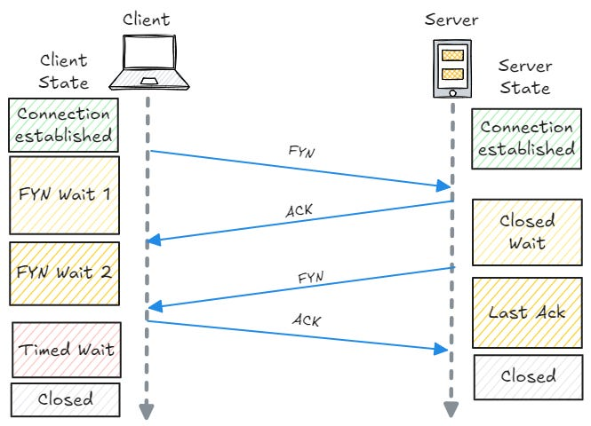

## TCP 4-Way Handshake (Connection Termination)

The **4-way handshake** is the process used by **TCP** to **gracefully close a connection**.

Unlike connection setup (3-way handshake), closing a TCP connection requires **four steps** because each side closes its connection independently.



---

## Step-by-Step Process

### 1) FIN (Client → Server)

* The client has finished sending data.
* It sends a **FIN** packet.

Example:

```
FIN
Seq = x
```

Meaning:
“I have no more data to send.”

---

### 2) ACK (Server → Client)

* The server acknowledges the FIN.

Example:

```
ACK = x + 1
```

Meaning:
“I received your FIN.”

At this point:

* Client → closed for sending
* Server → may still send data

---

### 3) FIN (Server → Client)

* When the server finishes sending its data, it sends its own **FIN**.

Example:

```
FIN
Seq = y
```

Meaning:
“I am also done sending data.”

---

### 4) ACK (Client → Server)

* The client acknowledges the server’s FIN.

Example:

```
ACK = y + 1
```

Meaning:
“Connection closed.”

---

## Visual Flow

```
Client                          Server
  | ---- FIN -----------------> |
  | <--- ACK ----------------- |
  | <--- FIN ----------------- |
  | ---- ACK ----------------> |
```

Connection is now terminated.

---

## Why 4 Steps Are Needed

* TCP connections are **full-duplex**
* Each direction is closed separately
* Both sides must agree that data transfer is complete

---

## Important Points

* Uses **FIN** and **ACK** flags
* Ensures **all data is delivered**
* More reliable than forceful termination
* Part of **TCP**, not UDP

---

## One-Line Definition

The TCP 4-way handshake is a four-step process (FIN, ACK, FIN, ACK) used to gracefully terminate a TCP connection.

